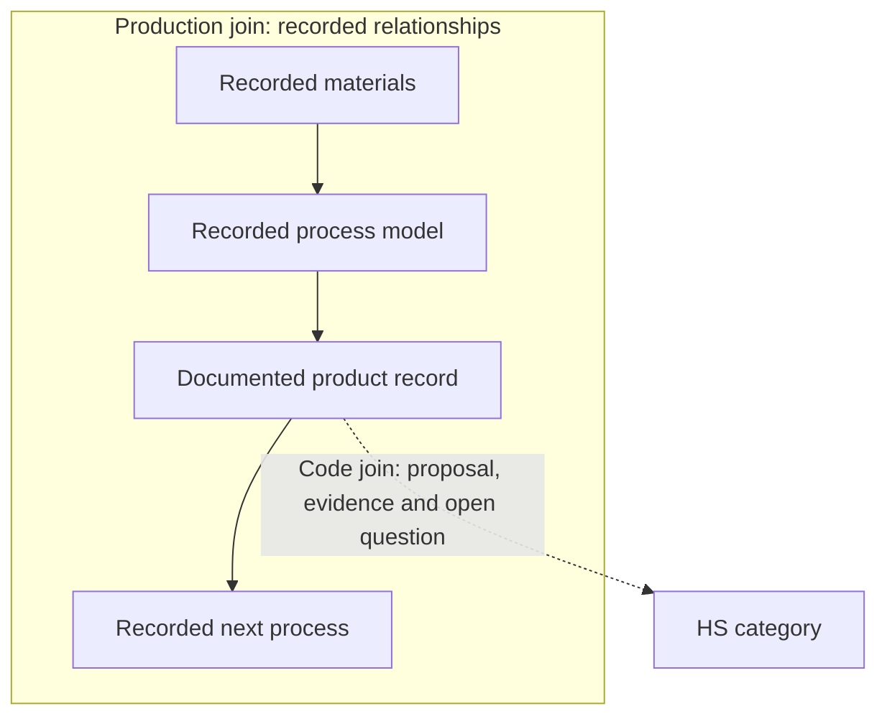

# HSGraph

HSGraph is an evidence-backed map of production relationships. Harmonized System
(HS) categories provide its classification layer. It connects documented product
records to the materials and processes recorded around them, and keeps proposed
customs classifications beside the evidence that supports or questions them.

**The graph is the product.** The published dataset is the current release of
that graph.

[Website](https://r-bedekar.github.io/hsgraph-open/) ·
[Download v0.1.0 on Zenodo](https://doi.org/10.5281/zenodo.22857372) ·
[Data card](DATA_CARD.md)

## One product record, two kinds of join

A join is a connection between records. The same product record connects the
production view and the classification view.



**The production join** shows what goes in, which process makes the product,
and where it is used next, wherever those relationships are explicitly recorded.
It follows recorded links and keeps gaps visible. A joined process is a recorded
model, not a supplier or a verified supply chain.

**The code join** connects that same product record to a proposed HS category.
The proposal stays beside the record, together with its evidence and open
question. If the record does not contain the fact the category depends on, the
join stays open. HSGraph does not choose a code or treat agreement between saved
checks as validation.

The production view helps a reader follow recorded dependencies. The
classification view helps a reader inspect why a category was proposed and what
still needs to be established. Support for a code join does not validate the
production relationships around it.

## What v0.1.0 contains

This release provides the graph as downloadable records, with a Python reader
for inspecting the records and following explicit links.

| Part of the graph | Included in v0.1.0 |
| --- | --- |
| HS 2022 classification structure | 6,936 identities: 96 chapters, 1,228 headings and 5,612 subheadings |
| Recorded production processes | 1,422 processes from the U.S. Life Cycle Inventory Database (USLCI) |
| Recorded exchanges | 76,211 primary exchange records describing inputs and outputs |
| Process links and gaps | 6,804 provider/gap records, including 3,495 traversable links |
| Product-identity checks | 670 saved assessments |
| Proposed code joins | 670 mapping projections |

See the [data card](DATA_CARD.md) for the full inventory, sources, exclusions and
known assessment failures. Counts describe retained records, not validated matches.

## Limits

HSGraph is not a customs ruling, a verified bill of materials or a computable
life-cycle inventory. This release has no specialist validation. Evidence,
automated findings and human review stay separate.

## Download, verify and load

Download `hsgraph-v0.1.0-dataset.zip` from
[Zenodo](https://doi.org/10.5281/zenodo.22857372). Obtain this repository checkout
and place the ZIP in its `work/` directory. The ZIP is distributed separately
from Git. `release-manifest.json` and `SHA256SUMS` identify the expected archive.

**Python 3.10+ and its standard library are sufficient. No API key is required.**
Run these commands from the repository checkout; no installation or dependency
download is needed:

```sh
python3 --version
python3 -m unittest discover -s tests -v
python3 -c "import json,subprocess,sys; m=json.load(open('release-manifest.json')); subprocess.run([sys.executable,'hsgraph_release.py','unpack','work/'+m['package_filename'],'work/package','--sha256',m['package_sha256']],check=True)"
python3 hsgraph_release.py verify work/package
python3 hsgraph_release.py load work/package --store work/hsgraph.sqlite
python3 hsgraph_release.py verify-store --store work/hsgraph.sqlite
```

Extraction and loading refuse to overwrite existing destinations. For another
run, choose fresh paths. The SQLite file is a local index of the published
records. Verification checks integrity and recorded references; it does not
validate a classification or production relationship.

Use `python3 hsgraph_release.py --help` to see the inspection commands. The reader
can retrieve records, display saved mappings and follow recorded process links.
See [the package and reader format](docs/FORMAT.md) for command details and how
unresolved links are retained.

The package's nested `candidate/` documents preserve historical build wording.
The outer v0.1.0 metadata describes this release; preparation status fields
record a build checkpoint rather than current publication availability.

## Provenance, licensing and concerns

Read [FORMAT.md](docs/FORMAT.md), [reproduction limits](docs/REPRODUCIBILITY.md),
[LICENSE-DATA](LICENSE-DATA) and the package's complete source notices. Original
code is Apache-2.0; original annotations are CC BY 4.0 only to the extent rights
are held. Third-party terms remain separate. Credits: DOE / NREL / Alliance
for Sustainable Energy; USLCI contributors; USITC; EPA/FEDEFL; NIST; BIPM.
No endorsement is implied.

Use this repository's Rights/Data Concern and Correction issue templates for
nonsensitive reports. Send sensitive rights/security concerns to
[rbedekar@zeroinsec.com](mailto:rbedekar@zeroinsec.com), not public issues.
See [CONTRIBUTING.md](CONTRIBUTING.md) and [SECURITY.md](SECURITY.md).
